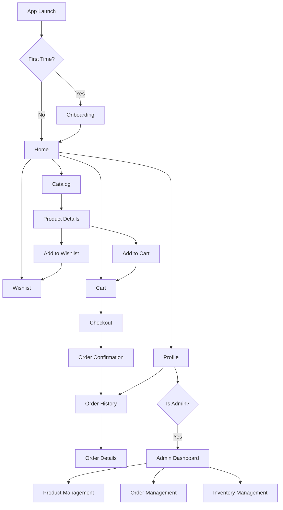

# Fashion E-Commerce Application Architecture

## Overview
This document outlines the technical architecture and implementation plan for a Flutter-based Fashion E-Commerce Application targeting streetwear and minimalist clothing. The app will provide a seamless shopping experience with user authentication, product browsing, secure checkout, and admin management capabilities.

## Core Features
- **Onboarding Screen**: Brand showcase with identity and style presentation
- **Home Screen**: Banners for new arrivals and featured items
- **Product Catalog**: Browse products with images, descriptions, and prices
- **Wishlist**: Save favorite items for later
- **Secure Checkout**: Support for Cash on Delivery, GCash, and PayPal
- **Order Tracking & History**: Monitor order status and view past purchases
- **Admin Dashboard**: Manage products, inventory, and orders
- **Push Notifications**: Alerts for promotions, drops, and restocks

## App Architecture

### Folder Structure
```
lib/
├── main.dart
├── models/
│   ├── product.dart
│   ├── user.dart
│   ├── order.dart
│   ├── cart_item.dart
│   └── category.dart
├── screens/
│   ├── onboarding/
│   ├── home/
│   ├── catalog/
│   ├── product_details/
│   ├── wishlist/
│   ├── cart/
│   ├── checkout/
│   ├── order_history/
│   ├── order_details/
│   └── admin/
├── widgets/
│   ├── product_card.dart
│   ├── banner_carousel.dart
│   └── custom_button.dart
├── services/
│   ├── api_service.dart
│   ├── auth_service.dart
│   ├── payment_service.dart
│   └── notification_service.dart
├── providers/
│   ├── auth_provider.dart
│   ├── cart_provider.dart
│   ├── wishlist_provider.dart
│   └── product_provider.dart
├── utils/
│   ├── constants.dart
│   └── helpers.dart
└── config/
    └── app_config.dart
```

### Data Models

#### Product Model
```dart
class Product {
  final String id;
  final String name;
  final String description;
  final double price;
  final List<String> images;
  final String category;
  final List<String> sizes;
  final List<String> colors;
  final int stock;
  final bool isFeatured;
  final DateTime createdAt;
}
```

#### User Model
```dart
class User {
  final String id;
  final String name;
  final String email;
  final String phone;
  final String address;
  final bool isAdmin;
}
```

#### Order Model
```dart
class Order {
  final String id;
  final String userId;
  final List<CartItem> items;
  final double total;
  final String status; // pending, confirmed, shipped, delivered
  final DateTime createdAt;
  final String paymentMethod;
  final String? trackingNumber;
}
```

#### CartItem Model
```dart
class CartItem {
  final String productId;
  final int quantity;
  final String? selectedSize;
  final String? selectedColor;
}
```

### Navigation Flow



### Required Dependencies
- `go_router`: Declarative routing
- `provider`: State management
- `http`: HTTP requests
- `cached_network_image`: Image caching
- `shared_preferences`: Local storage
- `firebase_core`: Firebase initialization
- `firebase_auth`: Authentication
- `cloud_firestore`: Database
- `firebase_messaging`: Push notifications
- `firebase_storage`: File storage
- `flutter_paypal`: PayPal integration
- `paymaya_flutter`: GCash integration
- `intl`: Date formatting
- `flutter_svg`: SVG support
- `carousel_slider`: Banner carousels
- `badges`: Notification badges

### UI/UX Design Concepts

#### Theme
- **Color Scheme**: Minimalist palette with black, white, and neutral tones
- **Typography**: Clean, modern fonts (e.g., Inter, Roboto)
- **Components**: Material Design 3 with custom fashion-focused styling

#### Screen Concepts
- **Onboarding**: 3-4 slides with high-quality fashion images and brand messaging
- **Home**: Hero banner carousel, category grid, featured products horizontal list
- **Catalog**: Grid/list toggle, filter sidebar, search functionality
- **Product Details**: Image gallery, size/color selectors, detailed specs
- **Wishlist**: Card-based layout with quick actions
- **Cart**: Editable items with quantity controls and totals
- **Checkout**: Multi-step form with payment method selection
- **Order Tracking**: Visual timeline with status updates
- **Admin Dashboard**: Tabbed interface with analytics and management tools

### State Management
Using Provider pattern with ChangeNotifier:

- **AuthProvider**: User authentication state
- **CartProvider**: Shopping cart management
- **WishlistProvider**: Saved items management
- **ProductProvider**: Product data and search
- **OrderProvider**: Order history and tracking

### Backend Integration
- **Platform**: Firebase (Firestore, Auth, Storage, Messaging)
- **Data Storage**: Firestore collections for users, products, orders
- **Authentication**: Firebase Auth with email/password and social logins
- **File Storage**: Firebase Storage for product images
- **Real-time Updates**: Firestore listeners for live data
- **Push Notifications**: Firebase Cloud Messaging

### Payment Integration
- **PayPal**: flutter_paypal package
- **GCash**: paymaya_flutter or custom integration
- **Cash on Delivery**: Manual order processing

### Security Considerations
- Secure API keys management
- Input validation and sanitization
- HTTPS for all network requests
- User data encryption
- Admin role verification

### Performance Optimizations
- Image caching and lazy loading
- Pagination for large lists
- Efficient state updates
- Background task handling
- Offline data caching

### Testing Strategy
- Unit tests for models and utilities
- Widget tests for UI components
- Integration tests for critical flows
- End-to-end testing for checkout process

### Deployment
- Android: Google Play Store
- iOS: Apple App Store
- CI/CD: GitHub Actions for automated builds
- Monitoring: Firebase Crashlytics

## Sprint 1 User Flows

### 1. User Accounts and Profile
**Target Users**: All users (Customers and Admins)

1. **App Launch**: User opens the app
2. **Authentication Check**: App checks if user is logged in
3. **Login/Register Prompt**: If not logged in, display login screen with options for email/password or social login
4. **Registration Flow**:
   - User taps "Create Account"
   - Enters name, email, password
   - Agrees to terms and conditions
   - Verifies email (optional)
   - Account created, auto-login
5. **Login Flow**:
   - User enters email and password
   - Taps "Login"
   - If successful, navigate to home
   - If failed, show error message
6. **Profile Access**:
   - From home screen, access profile via bottom navigation or drawer
   - View/edit personal details (name, email, phone, address)
   - Change password option
   - Logout option

### 2. Onboarding Screen
**Target Users**: New users (Customers)

1. **First Launch Detection**: App detects first-time user (no stored preference)
2. **Onboarding Start**: Display first slide with brand introduction
3. **Slide Navigation**:
   - User can swipe through 3-4 slides
   - Each slide shows fashion images and key app features
   - Skip button available on each slide
4. **Completion**: User taps "Get Started" on last slide
5. **Preference Storage**: Mark onboarding as completed
6. **Navigation**: Redirect to home screen

### 3. Home Screen
**Target Users**: All users (Customers and Admins)

1. **Screen Load**: Display after login/onboarding
2. **Banner Section**: Auto-playing carousel of featured/new arrival banners
3. **Category Grid**: Grid of fashion categories (Streetwear, Minimalist, etc.)
4. **Featured Products**: Horizontal scrollable list of featured items
5. **Navigation Elements**:
   - Bottom navigation bar (Home, Catalog, Wishlist, Profile)
   - Search bar at top
   - Cart icon with badge (if items exist)
6. **Interactions**:
   - Tap banner → Navigate to related product/category
   - Tap category → Filter catalog by category
   - Tap featured product → Open product details
   - Tap search → Open search screen
   - Tap bottom nav items → Switch screens

### 4. Product Catalog
**Target Users**: All users (Customers and Admins)

1. **Access**: From home screen via bottom navigation or category tap
2. **Initial View**: Display products in grid layout (default)
3. **Search Functionality**:
   - Tap search bar
   - Enter keywords
   - Real-time filtering of results
4. **Filtering Options**:
   - Tap filter button
   - Select category, price range, size
   - Apply filters
5. **View Toggle**: Switch between grid and list view
6. **Product Interaction**:
   - Tap product card → Open product details
   - Scroll for pagination (load more products)
7. **Sorting**: Sort by popularity, price, newest
8. **Back Navigation**: Return to home or previous screen

## Implementation Phases
1. **Phase 1**: Project setup, authentication, basic navigation
2. **Phase 2**: Product catalog, search, and details
3. **Phase 3**: Cart, wishlist, and checkout
4. **Phase 4**: Order management and tracking
5. **Phase 5**: Admin dashboard and push notifications
6. **Phase 6**: Testing, optimization, and deployment

## Next Steps
Review this architecture plan and provide feedback for refinements before proceeding to implementation.